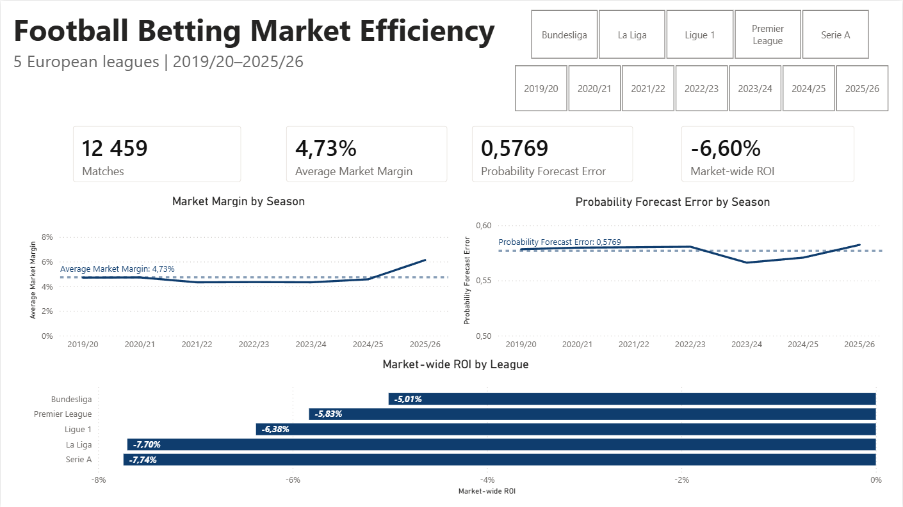
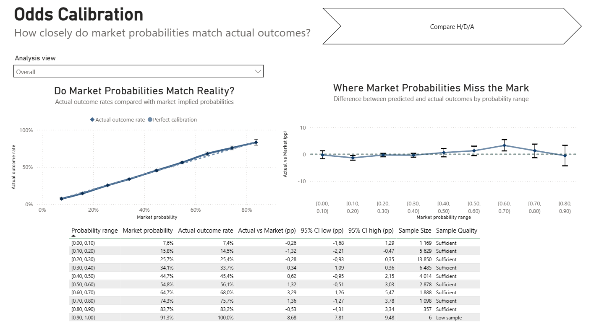
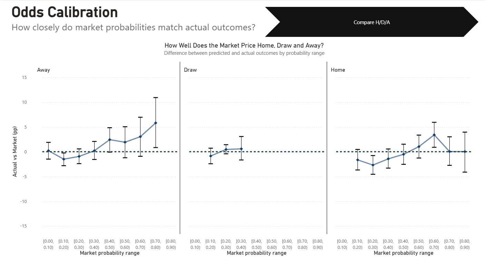
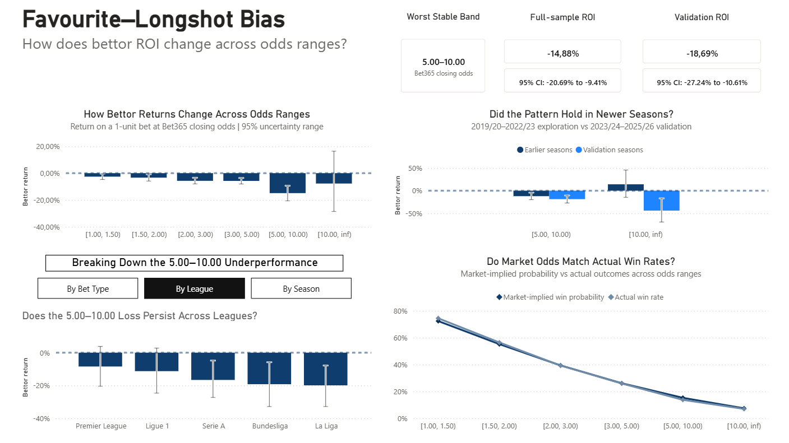
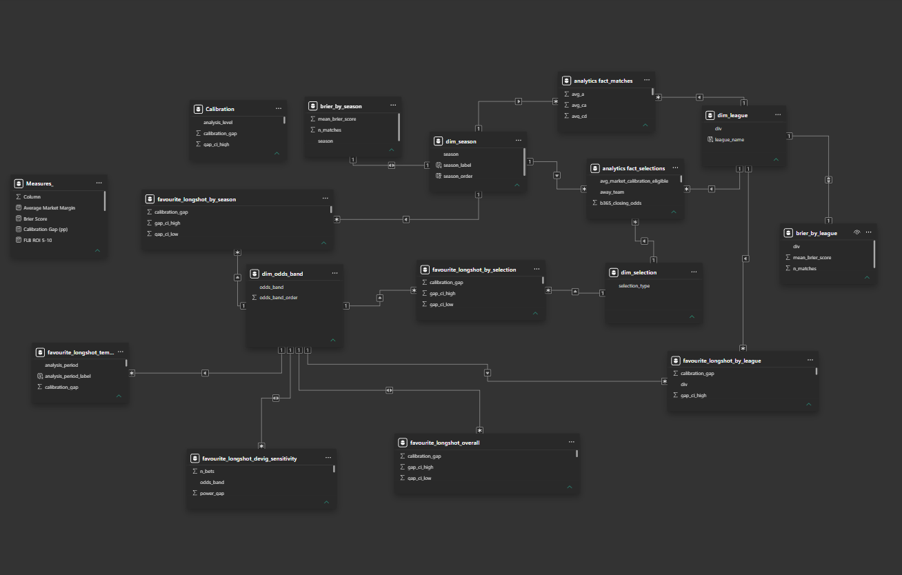

# Football Betting Market Efficiency

End-to-end analysis of football betting market calibration and favourite-longshot bias using **Python, PostgreSQL, statistical bootstrap methods, and Power BI**.

**Tech stack:** Python | pandas | PostgreSQL | SQL | Power BI | Bootstrap

## Dashboard Preview

### Market Overview



### Odds Calibration



The calibration page also includes a separate Home / Draw / Away comparison:



### Favourite-Longshot Bias



## Project Overview

The project examines two questions:

1. **Are football betting market probabilities well calibrated?**
2. **Do bettor returns change systematically between favourites and longshots?**

The analysis covers **12,459 matches** from five major European leagues between **2019/20 and 2025/26**.

The project separates two concepts that are often confused: probability accuracy and bettor profitability. A bookmaker can estimate outcome probabilities reasonably well while still offering prices that generate negative bettor returns because quoted odds include a margin.

## What This Means for a Bettor

The results point to a simple but important conclusion: **an uninformed bettor starts at a disadvantage in the football 1X2 market.**

* **Blindly betting the 1X2 market was consistently loss-making.** Across all Bet365 closing prices in the sample, market-wide historical ROI was **-6.60%**. All five leagues produced negative overall returns.

* **A high win rate does not make a bet profitable.** Short-priced favourites below 1.50 won roughly **74.5%** of selections, yet still produced negative ROI. Winning often is not enough if the price is worse than the underlying probability justifies.

* **Odds between 5.00 and 10.00 were the clearest danger zone.** This range produced **-14.88% ROI** in the full sample, with a 95% bootstrap CI of **[-20.69%, -9.41%]**. The result remained negative in the later validation period at **-18.69%**, and ROI was negative across every league and every season analysed.

* **Very high odds can create misleading short-term results.** The 10.00+ range returned approximately **+14.13%** during the exploration period but collapsed to **-44.12%** during validation. A few rare wins can make a strategy appear profitable until more data arrive.

* **Good probability estimates do not imply good betting prices.** The market was reasonably well calibrated overall, meaning quoted probabilities often matched actual outcome frequencies fairly closely. Yet bettors still lost money because the odds include bookmaker margin.

* **Being able to predict the winner is not the same as finding value.** Even when the market correctly estimates that an outcome has, for example, a 30% chance of occurring, the offered payout can still be too low to make the bet profitable.

In practical terms, a **bettor blindly staking across the 1X2 market would have lost about PLN 6.60 for every PLN 100 wagered on average**. Without an edge strong enough to overcome the bookmaker's pricing disadvantage, betting more simply means exposing more money to a negative expected return.


## Data

Source: [Football-Data.co.uk](https://www.football-data.co.uk/data.php)

| Dimension | Scope |
|---|---|
| Leagues | Premier League, Bundesliga, Serie A, La Liga, Ligue 1 |
| Seasons | 2019/20-2025/26 |
| Source files | 35 |
| Matches | 12,459 |
| Market | Full-time 1X2 |
| Calibration odds | Average-market closing odds |
| ROI odds | Bet365 closing odds |

The source archive contains historical schema drift, filename inconsistencies, and a small number of incomplete or invalid records. These were audited before the analytical dataset was created.

Full audit: [`reports/data_quality_audit.md`](reports/data_quality_audit.md)

## Analytical Workflow

```text
Football-Data CSV files
        |
        v
Python validation and preparation
        |
        v
matches_clean.csv
        |
        v
PostgreSQL analytical model
        |
        v
Python statistical analysis
        |
        v
Bootstrap outputs
        |
        v
Power BI
```

### Python

Python and pandas are used for data preparation, validation, calibration analysis, ROI analysis, bootstrap confidence intervals, sensitivity checks, and Power BI exports.

### PostgreSQL

The SQL layer separates match-level and selection-level grains:

- `analytics.fact_matches`: one row per match;
- `analytics.fact_selections`: three rows per match, one for Home, Draw, and Away;
- analytical marts for dashboard-level summaries and data-quality checks.

### Power BI

Power BI presents the validated SQL and Python outputs. Bootstrap inference is calculated in Python rather than recreated in DAX.

## Methodology

### Calibration

Average-market closing odds are converted to no-vig probabilities using proportional normalization.

```text
calibration_gap = observed_outcome_rate - mean_predicted_probability
```

The analysis uses ten fixed probability bins. Groups with fewer than **200 observations** remain in exported tables but are treated as sparse and excluded from primary interpretation.

Forecast quality is summarized with the unscaled three-outcome Brier Score:

```text
BS = (p_home - y_home)^2
   + (p_draw - y_draw)^2
   + (p_away - y_away)^2
```

### ROI

Bet365 closing prices are used for historical bettor returns with a one-unit stake:

```text
profit = odds - 1   if the bet wins
profit = -1         otherwise

ROI = total_profit / number_of_bets
```

### Bootstrap uncertainty

Home, Draw, and Away selections from the same match are dependent. Confidence intervals therefore use a **match-level cluster bootstrap** with **2,000 replicates**, resampling complete matches rather than individual selection rows.

### Temporal validation

The favourite-longshot analysis separates:

- **Exploration:** 2019/20-2022/23
- **Validation:** 2023/24-2025/26

Odds bands, the sparse-group rule, temporal split, and de-vig sensitivity method were fixed before the validation period was evaluated.

## Power BI Dashboard

The final non-COVID dashboard contains three pages:

### 1. Market Overview
Headline KPIs, market margin by season, probability forecast error by season, ROI by league, and League / Season filters.

### 2. Odds Calibration
Reliability curve, calibration gaps with bootstrap intervals, probability-bin details, and a separate Home / Draw / Away comparison.

### 3. Favourite-Longshot Bias
ROI by fixed odds band, bootstrap intervals, temporal validation, market-implied versus observed win rates, and robustness checks by bet type, league, and season.

## Data Model



The Power BI model uses shared dimensions including:

- `dim_league`
- `dim_season`
- `dim_selection`
- `dim_odds_band`

The match and selection fact tables remain separate to avoid duplicated observations and unsupported filter combinations.

## Data Quality

Key safeguards include:

- deterministic match identifiers;
- duplicate checks;
- result versus score reconciliation;
- odds validity checks;
- source coverage audits;
- fixed analytical bins;
- sparse-group rules;
- match-cluster bootstrap intervals;
- temporal validation;
- SQL, Python, and Power BI reconciliation.

Two notable source exceptions are documented:

- incomplete Bet365 closing odds for **Monaco vs Montpellier, 2020-10-18**;
- an invalid average-market closing-odds record for **Mallorca vs Barcelona, 2025-08-16**.

Affected matches are excluded only from analyses that require the problematic fields.

## Limitations

- Historical ROI does not imply future profitability.
- High-odds results are sensitive to rare events and small numbers of winners.
- Removing bookmaker margin is model-dependent.
- The dataset contains odds and outcomes, not bettor stakes or betting volume.
- Closing odds are observed close to kickoff and should not be treated as earlier actionable forecasts.
- Some Power BI views rely on precomputed statistical grains, so unsupported filter combinations are intentionally disabled.

## Repository Structure

```text
football-betting-market-efficiency/
|
├── README.md
├── requirements.txt
├── .gitignore
|
├── assets/
├── data/
│   └── processed/
├── notebooks/
│   ├── 00_data_preparation_and_validation.ipynb
│   ├── 01_market_calibration.ipynb
│   └── 02_favourite_longshot_ROI.ipynb
├── sql/
│   ├── 01_staging.sql
│   ├── 02_fact_matches.sql
│   ├── 03_fact_selections.sql
│   └── 04_analytical_marts.sql
├── power_bi/
│   └── football_market_efficiency.pbix
└── reports/
```

Raw source files are kept locally and are not included in the public repository.

## Reproducing the Analysis

Install dependencies:

```bash
pip install -r requirements.txt
```

Then run the pipeline in this order:

```text
00_data_preparation_and_validation.ipynb
        |
        v
01_staging.sql
02_fact_matches.sql
03_fact_selections.sql
04_analytical_marts.sql
        |
        v
01_market_calibration.ipynb
02_favourite_longshot_ROI.ipynb
        |
        v
Power BI
```

Local PostgreSQL credentials are stored in `.env`, which is excluded from version control.

## Responsible Interpretation

This project evaluates betting-market efficiency. It is **not a betting recommendation or a claim of a profitable strategy**.
